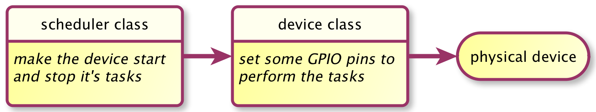
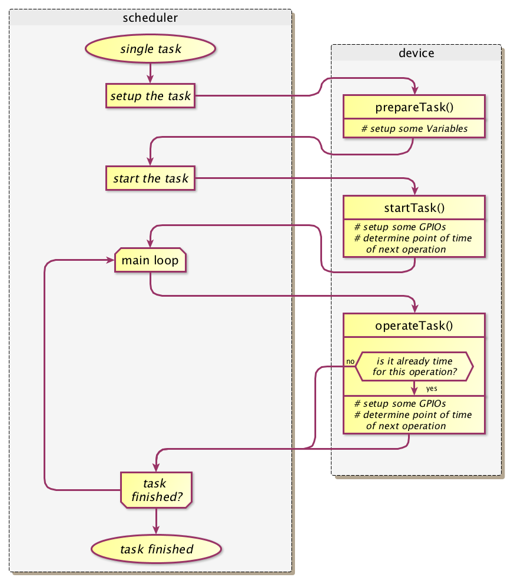
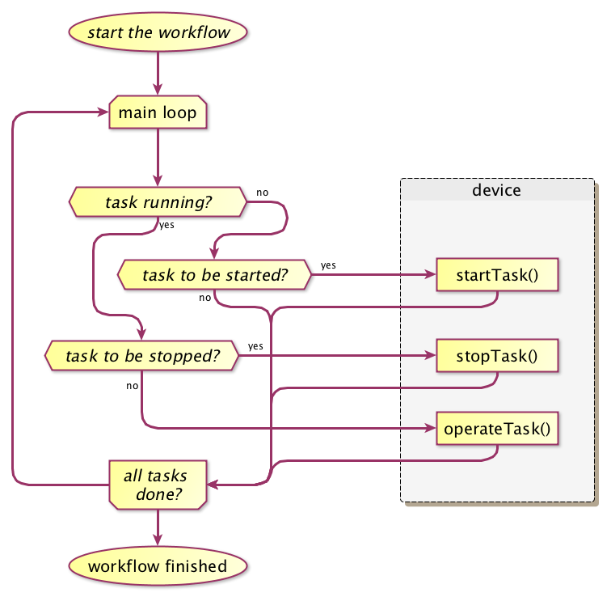

<h1>How it works</h1>

The target of developing this piece of software was to design a more or less univeral scheduler, suitable to meet needs that i am confronted with in my bussines. It should be able to switch things on and off, control stepper motors or servo motors, reacting to time- or electrical events. It should be  capable to work with any number of devices of several kind. Like a printing system, where different printers can be added to the printing system by providing a driver-software, different drivers for new devices should be addable easily.   
This scheduler should be easy to be set up, adjustable to the number and kind of devices needed, expandable and downscaleable as the project and the micro controller requires.
     
Basic concept of this scheduler-software is the strict separation of device controlling and device scheduling. All the scheduling is done by a scheduler unit. This scheduler unit starts, stops, supervises and coordinates all needed devices. The physical control of the device on the other side, is done by the device unit.  

The scheduling unit - represented by the scheduler class - reads the device’s task list and makes the device perform it's tasks. This class knows i.e. by witch event a device is to be started, if it is to be stopped or it stops normally by reaching it's target position etc. It’s counterpart, the device class, is responsible to control the device physically. This class knows, how to rotate the motor in the requested direction with the desired velocity and acceleration. That means, this class knows, how to enable it’s device (i.e. bring some GPIO-pins to a specified level), how to calculate the length of PWM-pulses for it’s servo, that shall make a constantly accelerated movement, or when exactly the next step of it’s stepper motor is to be done - and brings it to the electrical output.  
So, the scheduler works as follows:  
 

Looking to this scheme, it's obvious, that, setting up the GPIO's takes only some microseconds, whereas the task itself may rest thousands times longer. I.e. switching a lamp or even pulsing a lamp for maybe 20s at 50Hz takes just some micro seconds, where the device class really needs to work - however this "work" needs to be done precise at a specific date. 

<i>For exaple driving a stepper motor with a stepper motor driver like A9312: First, the stepper driver is to be set up. The DIR(ection) pin, the microstepping pins and the EN(able) pin are to be brought to suitable values and the pulse for the first step is to be given. This may take some microseconds. After that, nothing is to be done until the next step. The control can be given back to the scheduler.  When the time of the first step is elapsed and the next step is to be done, the control is needed again for giving a step pulse to the stepper driver. After that, again nothing is to be done, the control can be given back to the scheduler til the next step is to be made...</i>

+ This means on the one hand, that such a scheduler can easily control many devices, performing tasks with some GPIO maipulations (that are quite slow in comparison to the CPU of the controller).
+ On the other hand, this means, that the device class must be able to act exactly in time, if some time critical maipulation needs to take place, like when generating a PWM signal or setting the next step of a stepper motor.    

 
Generating a PWM signal or generating step pulses for a stepper motor is the misson of the device class. So the device class itself calculates and knows the time, when something is to be done, it knows the time, when control is needed. The scheduler now calls the device class as frequently as possible, so that this device class can determine itself, wether the time to operate has come - and operates as needed. 

To achieve this, the device class needs at least this three methods:
+ `prepareTask()`: setup all variables that are needed to perform the task (i.e. setup the target position, velocity and acceleration of a stepper), calculate and assign the parameters concerning the task (i.e. calculate parameters for the step-calculation)
+ `startTask()`: setup some variables, setup some GPIOs (i.e. setup the DIR- and microstepping-pins of a stepper driver to a suitable values, give the pulse for the first step), determine the point of time of the next operation (i.e. calculate, when the next step is to be done)
+ `operateTask()`: setup some variables, setup some GPIOs (i.e. give the pulse for this step), determine the point of time of the next operation (i.e. calculate, when the next step is to be done), determine if the task is finished

   

This way, it's easy to combine several devices and control them with the same scheduler:

Indeed the device class comes with some more methods and variables concerning this mechanism:
+ `attachDevice()`: configure the GPIOs that are used as OUTPUT or INPUT
+ `detachDevice()`: bring the GPIOs that are used to high impedance
+ `enableDevice()`: bring the ENable pins to appropriate level to enable the device (i.e. bring the /ENable pin of a motor driver to LOW-level)
+ `disableDevice()`: bring the ENable pins to appropriate level to disable the device (i.e. bring the /ENable pin of a motor driver to HIGH-level)
+ `reviewValues()`: determine, if the given parameters of a task are viable, do some convertions (i.e. degrees to count of steps)
+ `prepareNextTask()`: setup all variables that are needed (i.e. the target position of a stepper), assign the parameters (i.e. parameters for the step-calculation)
+ `startTask()`: do the initial GPIO manipulation to start and calculate, when the next manipulation has to take place
+ `operateTask()`: do the upcomming GPIO manipulation and calculate, when the next manipulation has to take place
+ `initiateStop()`: do all calculations and manipulations to make a task stop (i.e. initiate a ramp-down)
+ `stopTask()`: stop a task immediately
+ `finishTask()`: complete the whole process

Mutliple devices can easily be hung into the run loop:

My solution:
The device class calculates, or does even know, what to do next, and exactly when to do it (i.e. toggling a PWM-pin). All devices are included into the fundamental run loop, so, at every program cycle they are called and may perform the modifications that are needed.

The device it selves responds to the selector @c startTask() and runs all necessary code to start it’s task and returns. As well, it runs all the code to stop a task, when it’s selector @c stopTask() is called, and returns. When the selector @c operateTask() is called, the device class determines if anything is to be done within the task, does it and returns, or returns immediately.

Though operating different kinds of devices the scheduler needs to have different device classes - but all of them need to collaborate with the scheduler in the same matter. The specific class carries all the code, that is neccessary to control this specific kind of device, i.e. the code to generate the PWM signal is inside the DC-Controller class, the code to switch between half step and quarter step microstepping mode is inside the stepper class, the code to calculate an accelerated rotation of a servo motor is inside the servo class.

Other devices, needing different code to be controlled, can be added here easyly.

Compared to the 

All device classes (CCStepper class, CCServo class, CCDcControl class) are now inherited from the same base class (CCDevice class). So all sub classes share the same interface to be controlled with. They share a set of methods and members that are quite abstract - suitable to control common operations of arbitrary devices. They are:

 */